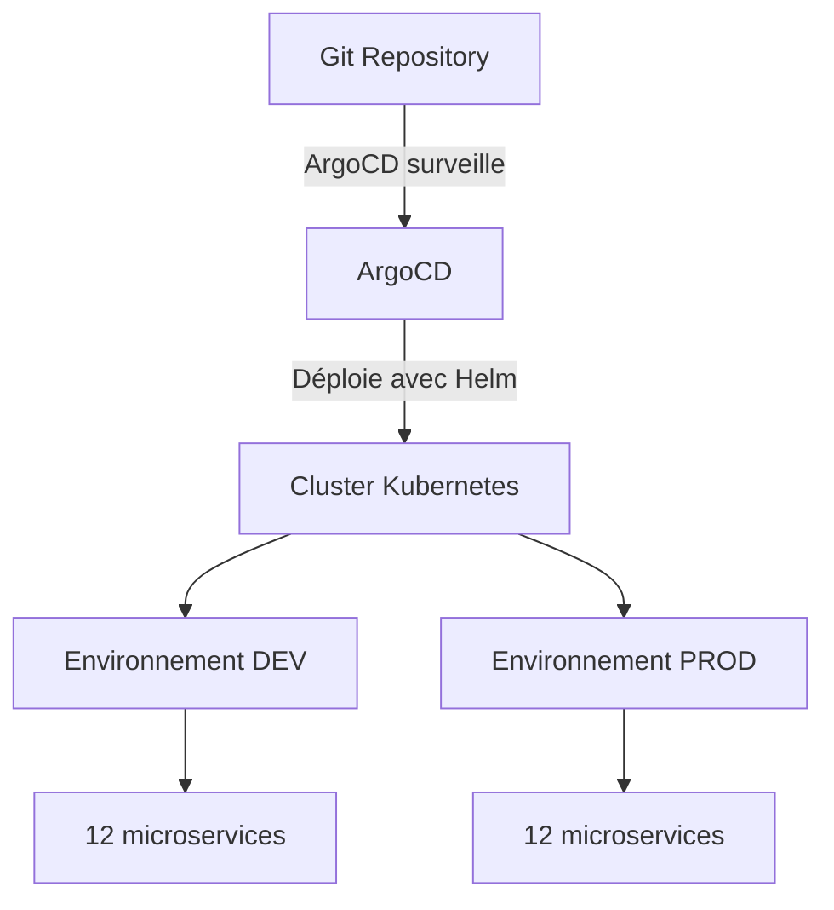

# TP Kubernetes - Online Boutique

Pour ce TP on déploie une application e-commerce (Online Boutique de Google) sur Kubernetes avec ArgoCD et Helm.

## Comment ça marche



Basiquement :
- On a un Helm Chart générique qui sert de template
- On a des fichiers de config différents pour chaque service (12 services)
- ArgoCD lit le repo Git et déploie automatiquement sur Kubernetes
- On a 2 environnements : DEV et PROD

## Installation

### 1. Créer le cluster

```bash
./start-cluster.sh
```

Ça crée un cluster Kind qui s'appelle `esiea-gitops-cluster`.

### 2. Déployer DEV

```bash
kubectl apply -k argocd/dev/
kubectl apply -k argocd/dev/
```

Oui il faut le faire 2 fois, c'est normal. La première fois ça installe ArgoCD, la deuxième fois ça déploie les apps.

### 3. Vérifier que ça marche

```bash
kubectl get applications -n argocd
```

Attendre que tout soit "Synced" et "Healthy".

### 4. Déployer PROD (optionnel)

```bash
kubectl apply -k argocd/prod/
kubectl apply -k argocd/prod/
```

## Accéder aux applications

### Voir l'interface ArgoCD

```bash
kubectl port-forward -n argocd svc/argocd-server 8080:443
```

Aller sur https://localhost:8080

Login : `admin`
Password : 
```bash
kubectl -n argocd get secret argocd-initial-admin-secret -o jsonpath='{.data.password}' | base64 -d && echo
```

### Voir l'application DEV

```bash
kubectl port-forward -n online-boutique-dev svc/frontend 8081:80
```

Aller sur http://localhost:8081

### Voir l'application PROD

```bash
kubectl port-forward -n online-boutique-prod svc/frontend 8082:80
```

Aller sur http://localhost:8082

## Arrêter tout

``./shutdown-cluster.sh``


## Différences DEV vs PROD

En DEV :
- 1 seul pod par service
- Moins de ressources 

En PROD :
- 2-3 pods par service
- Plus de ressources 
